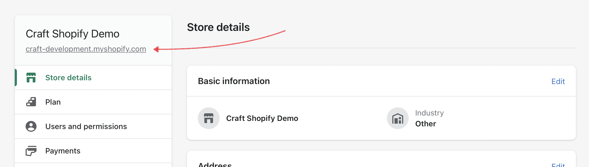

<p align="center"></p>

<h1 align="center">Shopify for Craft CMS</h1>

Connect your [Craft CMS](https://craftcms.com/) site to a [Shopify](https://shopify.com) store and keep your products in sync.

## Requirements

The Shopify plugin requires Craft CMS 4.0.0 or later.

## Installation

To install the plugin, visit the [Plugin Store](https://plugins.craftcms.com/shopify) from your Craft project, or follow these instructions.

1. Navigate to your Craft project in a new terminal:

    ```bash
    cd /path/to/project
    ```

2. Require the package with Composer:

    ```bash
    composer require craftcms/shopify -w
    ```

3. In the Control Panel, go to **Settings** → **Plugins** and click the “Install” button for Shopify, or run:

    ```bash
    php craft plugin/install shopify
    ```

### Create a Shopify App

The plugin works with Shopify’s [Custom Apps](https://help.shopify.com/en/manual/apps/custom-apps) system.

> **Note**  
> If you are not the owner of the Shopify store, have the owner add you as a collaborator or staff member with the [_Develop Apps_ permission](https://help.shopify.com/en/manual/apps/custom-apps#api-scope-permissions-for-custom-apps).

Follow [Shopify’s directions](https://help.shopify.com/en/manual/apps/custom-apps) for creating a private app (through the _Get the API credentials for a custom app_ section), and take these actions when prompted:

1. **App Name**: Choose something that identifies the integration, like “Craft CMS.”
2. **Admin API access scopes**: The following scopes are required for the plugin to function correctly:
    - `read_products`
    - `read_product_listings`

    Additionally (at the bottom of this screen), the **Webhook subscriptions** &rarr; **Event version** should be `2022-10`.
3. **Admin API access token**: Reveal and copy this value into your `.env` file, as `SHOPIFY_ADMIN_ACCESS_TOKEN`.
4. **API key and secret key**: Reveal and/or copy the **API key** and **API secret key** into your `.env` under `SHOPIFY_API_KEY` and `SHOPIFY_API_SECRET_KEY`, respectively.

#### Store Hostname

The last piece of info you’ll need on hand is your store’s hostname. This is usually what appears in the browser when using the Shopify admin—it’s also shown in the Settings screen of your store:



Save this value (_without_ the leading `http://` or `https://`) in your `.env` as `SHOPIFY_HOSTNAME`. At this point, you should have four Shopify-specific values:

```env
# ...

SHOPIFY_ADMIN_ACCESS_TOKEN="..."
SHOPIFY_API_KEY="..."
SHOPIFY_API_SECRET_KEY="..."
SHOPIFY_HOSTNAME="my-storefront.myshopify.com"
```

### Connect Plugin

Now that you have credentials for your custom app, it’s time to add them to Craft.

1. Visit the **Shopify** &rarr; **Settings** screen in your project’s control panel.
2. Assign the four environment variables to the corresponding settings, using the special [config syntax](https://craftcms.com/docs/4.x/config/#control-panel-settings):
    - **API Key**: `$SHOPIFY_API_KEY`
    - **API Secret Key**: `$SHOPIFY_API_SECRET_KEY`
    - **Access Token**: `$SHOPIFY_ACCESS_TOKEN`
    - **Host Name**: `$SHOPIFY_HOSTNAME`
3. Click **Save**.

> **Note**  
> These settings are stored in [Project Config](https://craftcms.com/docs/4.x/project-config.html), and will be automatically applied in other environments. [Webhooks](#set-up-webhooks) will still need to be configured for each environment!

### Set up Webhooks

Once your credentials have been added to Craft, a new **Webhooks** tab will appear in the **Shopify** section of the control panel.

Click **Generate** on the Webhooks screen to add the required webhooks to Shopify. The plugin will use the credentials you just configured to perform this operation—so this also serves as an initial communication test.

> **Warning**  
> You will need to add webhooks for each environment you deploy the plugin to, because each webhook is tied to a specific URL.

> **Note**  
> If you need to test live synchronization in development, we recommend using [ngrok](https://ngrok.com/) to create a tunnel to your local environment. DDEV makes this simple, with [the `ddev share` command](https://ddev.readthedocs.io/en/latest/users/topics/sharing/). Keep in mind that your site’s primary/base URL is used when registering webhooks, so you may need to update it to match the ngrok tunnel, then regenerate your webhooks.

## Product Element

Products from your Shopify store are represented in Craft as product [elements](https://craftcms.com/docs/4.x/elements.html), and can be found by going to **Shopify** &rarr; **Products** in the control panel.

### Synchronization

Products will be automatically created, updated, and deleted via [webhooks](#set-up-webhooks)—but Craft doesn’t know about a product until a change happens.

Once the plugin has been configured, perform an initial synchronization via the command line:

    php craft shopify/sync/products

> **Note**  
> Products can also be synchronized from the control panel using the **Shopify Sync** utility. Keep in mind that large stores (over a hundred products) may take some time to synchronize, and can quickly run through [PHP’s `max_execution_time`](https://www.php.net/manual/en/info.configuration.php#ini.max-execution-time).

### Native Attributes

In addition to the standard element fields like `id`, `title`, and `status`, each Shopify product element contains the following mappings to its canonical [Shopify Product resource](https://shopify.dev/api/admin-rest/2022-10/resources/product#resource-object):

Attribute | Description | Type
--------- | ----------- | ----
`shopifyId` | The unique product identifier in your Shopify store. | `String`
`shopifyStatus` | The status of the product in your Shopify store. Values can be `active`, `draft`, or `archived`. | `String`
`handle` | The product’s “URL handle” in Shopify, equivalent to a “slug” in Craft. For existing products, this is visible under the **Search engine listing** section of the edit screen. | `String`
`productType` | The product type of the product in your Shopify store. | `String`
`bodyHtml` | Product description. Use the `\|raw` filter to output it in Twig—but only if the content is trusted. | `String`
`publishedScope` | Published scope of the product in Shopify store. Common values are `web` (for web-only products) and `global` (for web and point-of-sale products). | `String`
`tags` | Tags associated with the product in Shopify. | `Array`
`templateSuffix` | [Liquid template suffix](https://shopify.dev/themes/architecture/templates#name-structure) used for the product page in Shopify. | `String`
`vendor` | Vendor of the product. | `String`
`metaFields` | [Metafields](https://shopify.dev/api/admin-rest/2022-10/resources/metafield#resource-object) associated with the product. | `Array`
`images` | Images attached to the product in Shopify. The complete [Product Image resources](https://shopify.dev/api/admin-rest/2022-10/resources/product-image#resource-object) are stored in Craft. | `Array`
`options` | Product options, as configured in Shopify. Each option has a `name`, `position`, and an array of `values`. | `Array`
`createdAt` | When the product was created in your Shopify store. | `DateTime`
`publishedAt` | When the product was published in your Shopify store. | `DateTime`
`updatedAt` | When the product was last updated in your Shopify store. | `DateTime`

All of these properties are available when working with a product element [in your templates](#templating).

> **Note**  
> See the Shopify documentation on the [product resource](https://shopify.dev/api/admin-rest/2022-04/resources/product#resource-object) for more information about what kinds of values to expect from these properties.

### Custom Fields

Products synchronized from Shopify have a dedicated field layout, which means they support Craft’s full array of [content tools](https://craftcms.com/docs/4.x/fields.html).

The product field layout can be edited by going to **Shopify** &rarr; **Settings** &rarr; **Products**, and scrolling down to **Field Layout**.

### Product Status

A product’s `status` in Craft is a combination of its `shopifyStatus` attribute ('active', 'draft', or 'archived') and its enabled state. The former can only be changed from Shopify; the latter is set in the Craft control panel.

> **Note**  
> Statuses in Craft are often a synthesis of multiple properties. For example, an entry with the _Pending_ status just means it is `enabled` _and_ has a `postDate` in the future.

In most cases, you’ll only need to display “Live” products, or those which are _Active_ in Shopify and _Enabled_ in Craft:

Status | Shopify | Craft
------ | ------- | -----
`live` | Active | Enabled
`shopifyDraft` | Draft | Enabled
`shopifyArchived` | Archived | Enabled
`disabled` | Any | Disabled

### Methods

The product element also has a couple of methods you might find useful in your [templates](#templating):

```twig
{# Get a link to the product’s page on Shopify: #}
<a href="{{ product.getShopifyUrl() }}">View on our store</a>

{# Link to a product with a specific variant pre-selected: #}
<a href="{{ product.getShopifyUrl({ variant: variant.id }) }}">Buy now</a>
```

For your administrators, you can even link directly to the Shopify admin:

```twig
{# Assuming you’ve created a custom group for Shopify admin: #}

  <a href="{{ product.getShopifyEditUrl() }}">Edit product on Shopify</a>

```

## Querying Products

Products can be queried like any other element in the system.

A new query begins with the `craft.shopifyProducts` factory function:

```twig

```

### Query Parameters

The following element query parameters are supported, in addition to [Craft’s standard set](https://craftcms.com/docs/4.x/element-queries.html).

> **Note**
> Fields stored as JSON (like `options` and `metadata`) are only queryable as plain text. If you need to do advanced organization or filtering, we recommend using custom Category or Tag fields in your Product [field layout](#custom-fields).

#### `shopifyId`

Filter by Shopify product IDs.

```twig
{# Watch out—these aren't the same as element IDs! #}

```

#### `shopifyStatus`

Directly query against the product’s status in Shopify.

```twig

```

Use the regular `.status()` param if you'd prefer to query against [synthesized status values](#product-status).

#### `handle`

Query by the product’s handle, in Shopify.

```twig

```

> :rotating_light: This is not a reliable means to fetch a specific product, as the value may change during a synchronization. If you want a permanent reference to a product, consider using the Shopify [product field](#product-field).

#### `productType`

Find products by their “type” in Shopify.

```twig

```

#### `publishedScope`

Show only products that are published to a matching sales channel.

```twig
{# Only web-ready products: #}


{# Everything: #}

```

#### `tags`

Tags are stored as a comma-separated list. You may see better results using [the `.search()` param](https://craftcms.com/docs/4.x/searching.html#development).

```twig
{# Find products whose tags include the term in any position, with variations on casing: #}

```

#### `vendor`

Filter by the vendor information from Shopify.

```twig
{# Find products with a vendor matching either option: #}

```

#### `images`

Images are stored as a blob of JSON, and only intended for use in a template in conjunction with a loaded product. Filtering directly by [image resource](https://shopify.dev/api/admin-rest/2022-04/resources/product-image#resource-object) values can be difficult and unpredictable—you may see better results using [the `.search()` param](https://craftcms.com/docs/4.x/searching.html#development).

```twig
{# Find products that have an image resource mentioning "stripes": #}

```

#### `options`

Options are stored as a blob of JSON, and only intended for use in a template in conjunction with a loaded product. You may see better results using [the `.search()` param](https://craftcms.com/docs/4.x/searching.html#development).

```twig
{# Find products that use a "color" option: #}

```

The above includes quote (`"`) literals, because it’s attempting to locate a specific key in a JSON array, which will always be surrounded by double-quotes.

## Templating

### Product Data

Products behave just like any other element, in Twig. Once you’ve loaded a product via a [query](#querying-products), you can output its native [Shopify attributes](#native-attributes) and [custom field](#custom-fields) data.

> **Note**  
> Keep in mind that some attributes are stored as JSON, which inherently limits which types nested properties can use. Dates may be slightly more difficult to work with, as a result.

```twig
{# Standard element title: #}
{{ product.title }}
  {# -> Root Beer #}

{# Shopify HTML content: #}
{{ product.bodyHtml | raw }}
  {# -> <p>...</p> #}

{# Tags, as list: #}
{{ product.tags | join(', ') }}
  {# -> sweet, spicy, herbal #}

{# Tags, as filter links: #}

  <a href="{{ siteUrl('products', { tag: tag }) }}">{{ tag | title }}</a>
  {# -> <a href="https://mydomain.com/products?tag=herbal">Herbal</a> #}


{# Images: #}

  
    {# ->  #}


{# Variants: #}
<select name="variant">
  
    <option value="{{ variant.id }}">{{ variant.title }}</option>
  
</select>
```

### Cart

Your customers can add products to their cart directly from your Craft site:

```twig


<form action="{{ craft.shopify.store.getUrl('cart/add') }}" method="post">
  <select name="id">
    
      <option value="{{ variant.id }}">{{ variant.title }}</option>
    
  </select>

  {{ hiddenInput('qty', 1) }}

  <button>Add to Cart</button>
</form>
```

### Helpers

In addition to [product element methods](#methods), the plugin exposes its API to Twig via `craft.shopify`.

#### API Service

> **Warning**  
> Use of API calls in Twig blocks rendering and—depending on traffic—may cause timeouts and/or failures due to rate limits. Consider using the [`` tag](https://craftcms.com/docs/4.x/dev/tags.html#cache) with a key and specific expiry time to avoid making a request every time a template is rendered:
> ```twig
> 
>   {# API calls + output... #}
> 
> ```

Issue requests to the Shopify Admin API via `craft.shopify.api`:

```twig


```

The schema for each API resource will differ. Consult the [Shopify API documentation](https://shopify.dev/api/admin-rest) for more information.

#### Store Service

A simple URL generator is available via `craft.shopify.store`. You may have noticed it in the [cart](#cart) example, above—but it is a little more versatile than that!

```twig
{# Create a link to add a product/variant to the cart: #}
{{ tag('a', {
  href: craft.shopify.store.getUrl('cart/add', {
    id: variant.id
  }),
  text: 'Add to Cart',
  target: '_blank',
}) }}

{# Link to a product page #}
```

## Product Field

The plugin provides a _Shopify Products_ field, which uses the familiar [relational field](https://craftcms.com/docs/4.x/relations.html) UI to allow authors to select Product elements.

Relationships defined with the _Shopify Products_ field use stable element IDs under the hood. When Shopify products are archived or deleted, the corresponding elements will also be updated in Craft, and naturally filtered out of your query results—including those explicitly attached via a _Shopify Products_ field.

> **Note**  
> Upgrading? Check out the [migration](#migrating-from-v2x) notes for more info.

---

## Migrating from v2.x

If you are upgrading a Craft 3 project to Craft 4 and have existing “Shopify Product” fields, you’ll need show the plugin how to translate plain Shopify IDs (stored as a JSON array) into element IDs, within Craft’s relations system.

> **Warning**  
> Before getting started with the migration, make sure you have [synchronized](#synchronization) your product catalog.

It’s safe to remove the old plugin package (`nmaier95/shopify-product-fetcher`) from your `composer.json`—but **do not uninstall it** from the control panel. We want the field’s data to stick around, but don’t need the old field class to work with it.

> **Note**  
You may see a “missing field” in your field layouts during this process—that’s OK! Your data is still there.

For each legacy Shopify Product field in your project, do the following:

1. Create a _new_ [Shopify Products](#product-field) field, giving it a a new handle and name;
2. Add the field to any layouts where the legacy field appeared;

### Re-saving Data

Run the following command (substituting appropriate values) for each place you added the field in step #2, above:

    - `resave/entries` &rarr; The [re-save command](https://craftcms.com/docs/4.x/console-commands.html#resave) for the element type the field layout is attached to;
    - `mySectionHandle` &rarr; A stand-in for any criteria that need to be applied to the element type you’re re-saving;
    - `oldShopifyField` &rarr; Field handle from the old version of the plugin (used inside the `--to` argument closure);
    - `newShopifyField` &rarr; New field handle created in step #1, above;

    ```bash
    php craft resave/entries \
      --section=mySectionHandle \
      --set=newShopifyField \
      --to="fn(\$entry) => collect(json_decode(\$entry->oldShopifyField))->map(fn (\$item) => \craft\shopify\Plugin::getInstance()->getProducts()->getProductIdByShopifyId(\$item))->unique()->all()"
    ```

### Updating Templates

After your content is re-saved, update your templates:

#### Before

```twig
{# Product references were stored as a list of IDs: #}


<ul>
  
    {# Query Shopify API for Product using ID: #}
    

    <li>{{ product.productType }}: {{ product.title }}</li>
  
</ul>
```

#### After

There is no need to query the Shopify API to render product details in your templates—all of the data is ready in the returned elements!

```twig
{# Execute query from relational field: #}


<ul>
  
    {# Output product data directly: #}
    <li>{{ product.productType }}: {{ product.title }}</li>
  
</ul>
```

## Going Further

### Element API

Your synchronized products can be published into an [Element API](https://plugins.craftcms.com/element-api) endpoint, just like any other element type. This allows you to set up a local JSON feed of products, decorated with any content you’ve added in Craft:

```php
use craft\shopify\elements\Product;

return [
  'endpoints' => [
    'products.json' => function() {
      return [
        'elementType' => Product::class,
        'criteria' => [
          'publishedScope' => 'web',
          'with' => [
            ['myImageField']
          ],
        ],
        'transformer' => function(Product $product) {
          $image = $product->myImageField->one();

          return [
            'title' => $product->title,
            'variants' => $product->getVariants(),
            'image' => $image ? $image->getUrl() : null,
          ];
        },
      ];
    },
  ],
];
