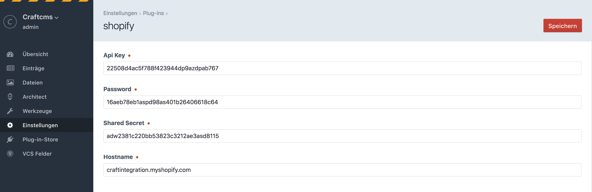

# Shopify plugin for Craft CMS 3.x


## Requirements

This plugin requires Craft CMS 3.0.0-beta.23 or later.

## Installation

#### Composer
Install the plugin via composer into your craft 3 project:

    composer require nmaier95/shopify-product-fetcher

In the Control Panel of Craft, go to Settings → Plugins and click the “Install” button for shopify.

#### Craft Plugin Store

We are listed inside the official Craft Plugin Store. You may directly install it here as well.

#### Manually
Please see the official docs of Craft:

https://docs.craftcms.com/v3/extend/plugin-guide.html#loading-your-plugin-into-a-craft-project


## Configuring shopify

Once the plugin is installed successfully, a new icon with this' plugins logo on the settings-page appeared. Clicking it takes you to the settings of the plugin. 



!! Please stick to the format of the "Hostname" field like in the example above !!

## Using shopify

There will be an additional field of type "Shopify Product" in the list of all available field-types when creating a new field for a group. 
Then add this field/group to your section layout and you are ready to go. 
When editing the section it´ll now automatically fetch products from your store into the field to select them from. 
In the background only the product id gets saved into your database. 
Via the saved product-id you are then able to fetch specific products inside of your templates.

### Samples
#### Usage of products selected inside of an entry
```twig


    

    {{ dump(shopifyProduct) }}


```


#### Get all products of my shop
```twig


<form action="//{{craft.shopify.getSettings().hostname}}/cart/add" method="post">
    <select name="id">
        
            <option value="{{ product.variants[0].id }}">{{ product.title }} - ${{ product.variants[0].price }}</option>
        
    </select>
    <input type="hidden" name="return_to" value="back">
    <button type="submit">Add to Cart</button>
</form>
```

Both ```craft.shopify.getProductById()``` and ```craft.shopify.getProducts()``` support an optional 'options' parameter which takes shopify-api options for requests. For further documentation please use official shopify api docs.
For example ```craft.shopify.getProducts({fields: 'variants'})```


Brought to you by [niklas maier](https://maier-niklas.de/)
<br>
You may also find me inside of the official [Craft Slack](https://craftcms.com/slack).