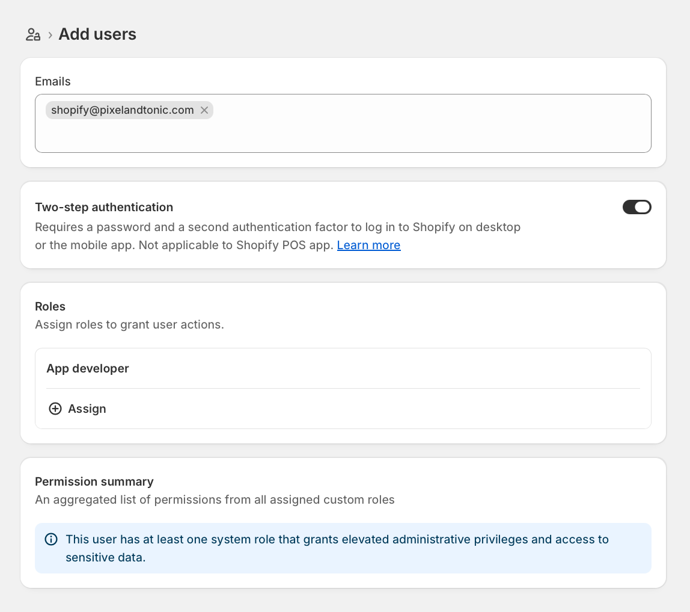
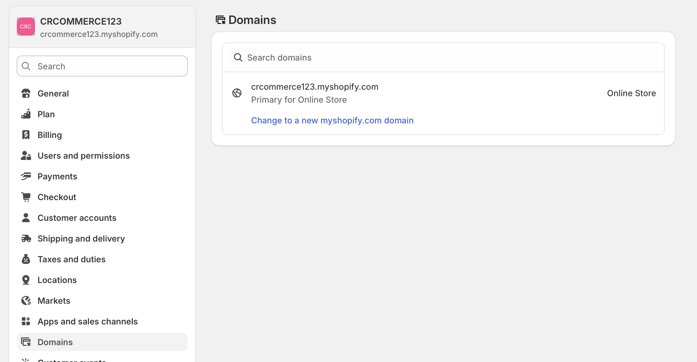

<p align="center"></p>

<h1 align="center">Shopify for Craft CMS</h1>

Build a content-driven storefront by synchronizing [Shopify](https://shopify.com) products into [Craft CMS](https://craftcms.com/).

> [!IMPORTANT]
> Version 7.x of Shopify for Craft uses a new app-based authorization system.
> You must follow the [upgrade instructions](#upgrading) to get new credentials.

## Topics

- :package: [Installation](#installation): Set up the plugin and get connected to Shopify.
- :card_file_box: [Working with Products](#product-element): Learn what kind of data is available and how to access it.
- :bookmark_tabs: [Templating](#templating): Tips and tricks for using products in Twig.
- :leaves: [Upgrading](#upgrading): Take advantage of new features and performance improvements.
- :telescope: [Advanced Features](#going-further): Go further with your integration.

## Installation

Shopify requires Craft CMS 5.10.7+.

To install the plugin, visit the [Plugin Store](https://plugins.craftcms.com/shopify) from your Craft project, or follow these instructions.

1. Navigate to your Craft project in a new terminal:

   ```bash
   cd /path/to/project
   ```

2. Require the package with Composer:

   ```bash
   composer require craftcms/shopify -w
   ```

3. In the Control Panel, go to **Settings** → **Plugins** and click the “Install” button for Shopify, or run:

   ```bash
   php craft plugin/install shopify
   ```

## Connect to Shopify

The plugin works with Shopify’s [Dev Dashboard](https://shopify.dev/docs/apps/build/dev-dashboard) app system, and is split into two primary parts: [creating an app](#create-an-app) and [performing authorization](#install-in-a-store).

To install an app into a store, one of these statements must describe your account’s relationship with it:
- You are the owner of the store;
- You have been added as a collaborator on the store, with the [App developer role](https://shopify.dev/docs/apps/build/dev-dashboard/user-permissions) (see screenshot, below);
- You are working with a [dev store](https://shopify.dev/docs/apps/build/dev-dashboard/development-stores) or [client transfer store](https://help.shopify.com/en/partners/manage-clients-stores/client-transfer-stores/create-client-transfer-stores) belonging to your Partner organization;



> [!CAUTION]
> The new OAuth-based API connection requires that apps are created from an “organization” that has access to the [Partner Dashboard](https://www.shopify.com/partners).
> Standalone stores (like the one created when you sign up for a Shopify account) belong to their own organization.
>
> - If you are working with a store or account that has never accessed a Partner Dashboard, **you must create a Partner profile before proceeding**.
> - When working from an account that has access to multiple organizations, **it is generally safest to access the new Dev Dashboard _via_ the Partner Dashboard you want the app associated with.**

### Create an App

1. Navigate to your **Dev Dashboard**:
   - From a store, open the account context menu (upper-right corner) and select **Dev Dashboard**;
   - From the Partner Dashboard, open the account context menu (upper-right corner) and select **Dev Dashboard**;
1. In the Dev Dashboard, press **Create app**.
1. In the first screen, pick an **App name** that identifies the integration, like _Craft CMS_.
1. Press **Create**, then fill out the following fields to create your first “version”:
    - **App URL**: Retrieve the **Shopify App Auth URL** value from the plugin’s setting screen in the Craft control panel. (This will always be your project’s URL, followed by the [cpTrigger](https://craftcms.com/docs/5.x/reference/config/general.html#cptrigger), then the action `shopify/auth`: `https://my-project.com/admin/shopify/auth`.)
    - **Embed app in Shopify admin**: Make sure this is _unchecked_, as the plugin does not support embedded apps.
    - **Webhooks API Version**: Choose `2026-01`, and add the same string to your project’s `.env` file:
        ```bash
        SHOPIFY_WEBHOOK_VERSION="2026-01"
        ```
    - **Access** &rarr; **Scopes**: The following scopes are always required:
        - `read_inventory`
        - `read_product_listings`
        - `read_products`
        
        If you plan to enable any **Additional Features** or **Custom Scopes** in the plugin settings, those will require additional scopes. Once the plugin is installed and configured, use the read-only **Scopes** field in **Shopify** &rarr; **Settings** as the source of truth: it always reflects the full, comma-separated string to paste here.
        
        > [!WARNING]
        > If you later change your **Additional Features** or **Custom Scopes** settings, you must update the scopes in your Shopify app configuration and then re-authorize the app from the Craft control panel.
    - Do _not_ enable the **Use legacy install flow** as it can result in mismatched scopes during installation.
1. Press **Release** to deploy the configuration. You may give it a name and description, or let Shopify tag it with an incrementing number.
1. Switch to the **Settings** screen of the new app, and copy the credentials into your `.env` file:
    ```bash
    SHOPIFY_CLIENT_ID="..." # Client ID
    SHOPIFY_CLIENT_SECRET="..." # Secret
    ```

Next, you’ll configure the app’s _distribution_ scheme.

1. From the new app’s **Home** screen in the Dev Dashboard, follow the **Select distribution method** link, within the **Distribution** widget.
1. The Partner Dashboard will open, with your app selected. Choose **Custom distribution**, press **Select**, then confirm in the dialog box.
1. Locate your store’s _hostname_ (see screenshot, below), and paste it into the **Store domain** field, then press **Generate link**.
    - _Once you choose a hostname, the app is permanently locked to that store. If you do not provide the correct hostname at this stage, you’ll need to delete the app and start over._
    - If you want to use the same connection across multiple related stores, check **Allow multi-store install for one Plus organization**.
    - Take this opportunity to add the hostname to your `.env` file:
    ```bash
    SHOPIFY_HOSTNAME="my-store-name.myshopify.com"
    ```
1. Return to the **Distribution** screen and press **Copy link**.



You should now have a total of _four_ `SHOPIFY_*` variables in your `.env` file:

```bash
# 1. Webhook API Version
#    This is tied to your app’s release, and should not change (except potentially during a future plugin upgrade).
SHOPIFY_WEBHOOK_VERSION="2026-01"

# 2. Client ID
#    This can be found in your Shopify app’s Settings screen.
SHOPIFY_CLIENT_ID="..."

# 3. Secret
#    This can be found in your Shopify app’s Settings screen.
SHOPIFY_CLIENT_SECRET="..."

# 4. Hostname
#    Found in your store’s settings screen. Include only the domain (no leading `https://`)
SHOPIFY_HOSTNAME="my-store-name.myshopify.com"
```

In the Craft control panel, navigate to **Shopify** &rarr; **Settings** to configure the plugin:

- **API Version**: `$SHOPIFY_WEBHOOK_VERSION`
- **Client ID**: `$SHOPIFY_CLIENT_ID`
- **Client Secret Key**: `$SHOPIFY_CLIENT_SECRET`
- **Host Name**: `$SHOPIFY_HOSTNAME`

Use these literal strings in the corresponding fields.
As you type the `$`-prefixed value into an input, Craft will [suggest](https://craftcms.com/docs/5.x/system/project-config.html#secrets-and-the-environment) matching variables.

Press **Save** to commit the settings to [project config](https://craftcms.com/docs/5.x/system/project-config.html).

> [!TIP]
> You may see a warning below the read-only **Shopify App Auth URL** field.
> This is expected, until you’ve completed the OAuth flow!

### Install in a Store

In this step, we’ll perform the [authorization code grant](https://shopify.dev/docs/apps/build/authentication-authorization/access-tokens/authorization-code-grant) or _OAuth_ flow, during which Craft and Shopify negotiate a long-lived access token.

> [!TIP]
> Whoever installs the app must be able to access to the store _and_ the Craft project from the same browser.
> Shopify does _not_ need to directly contact the Craft, so you may do this from your local development machine!

1. Visit the installation URL you copied from the **Distribution** screen in the Partner Dashboard. You must be logged in to a Shopify account with access to the target store (but it does not need to be the same account that created the app).
1. Select the store in Shopify’s context picker.
1. On the **Install app** screen within the store’s admin, review the permissions and press **Install**.
   > [!WARNING]
   > If you do not see a blue banner confirming **This app is exclusive to your store**, _do not proceed_!
   > A banner saying **This app can’t be installed on this store** (or landing on a generic Shopify error page) usually means that the hostname is not valid for the distribution.
1. You will be redirected to the Craft control panel “auth” URL you used when creating the Shopify app. (If you were not already logged in, Craft will ask for your username and password; your user must have the **Access Shopify** permission or be an administrator to complete the authorization flow.)
1. Press **Authorize** in the dialog.
1. Craft and Shopify will perform the OAuth handshake, and you should land on a confirmation screen in the Craft control panel saying **Your Shopify app has been successfully authorized**.

🎊 Congratulations! Your Craft project can now communicate with the Shopify API.
Let’s take it for a spin by importing your store’s products.

### Set up Webhooks

A new **Webhooks** tab will appear in the **Shopify** section of the control panel once you’ve completed the authorization flow.

Click **Create webhooks** on the Webhooks screen to add the required webhooks to Shopify.
The plugin will use your newly-issued access token to perform this operation, so this also serves as an initial communication test.

> [!WARNING]
> You must add webhooks for every environment you deploy the plugin to; webhooks are tied to the specific, registered URL.
> Be aware that Shopify will continue to attempt delivery to your development environment’s subscriptions, which may impact the statistics you see in the Dev Dashboard.
> See [Cleanup](#cleanup) below for help culling unused webhook subscriptions.

#### Testing Webhooks

Development environments are not typically exposed to the public internet, which means Shopify won’t be able to deliver webhooks.
To test synchronization in development, we recommend using [ngrok](https://ngrok.com/) to create a tunnel to your local environment.
DDEV makes this simple, with [the `ddev share` command](https://ddev.readthedocs.io/en/latest/users/topics/sharing/).

> [!TIP]
> Use the `SHOPIFY_PUBLIC_DEV_URL` environment variable to override your project’s base URL when creating webhooks; this allows you to continue using your regular DDEV site URL for control panel and front-end access, rather than overriding the entire project or site’s base URL.
>
> This setting may not work if you have set a custom `cpBaseUrl`!

#### Cleanup

Each time you open an `ngrok` tunnel, you get a new public URL, and Shopify will be unable to deliver webhooks.
This means that you may accumulate broken subscriptions over the course of development.
In the control panel, we only display the webhooks relevant to the _current_ environment—or, more accurately, those with a `uri` matching the resolved webhook URL (which can be influenced by the `SHOPIFY_PUBLIC_DEV_URL` variable).

You can delete individual webhooks from the control panel, or by using the [CLI GraphQL playground](#graphql-playground)…

```bash
php craft shopify/api/query 'mutation deleteWebhook {
  webhookSubscriptionDelete(id: "gid://shopify/WebhookSubscription/123456789") {
    userErrors {
      field
      message
    }
    deletedWebhookSubscriptionId
  }
}'
```

…substituting a known subscription GID.
Discover orphaned subscriptions using the [`webhookSubscriptions()`](https://shopify.dev/docs/api/admin-graphql/2026-01/queries/webhookSubscriptions) query.

## Upgrading

This version (7.x) is primarily concerned with Shopify API compatibility, but the [new authentication mechanism](#connect-to-shopify) means that you’ll need to re-establish the connection to Shopify using the authentication scheme [described above](#connect-to-shopify).

Due to significant shifts in Shopify’s developer ecosystem, many of the [front-end cart management](#front-end-sdks) techniques we have recommended (like the _JS Buy SDK_ and _Buy Button JS_) are no longer viable.

> [!TIP]
> We strongly recommend reviewing this same section on the [6.x](https://github.com/craftcms/shopify/blob/6.x/README.md#upgrading) branch, as there were a number of breaking changes and deprecations during the upgrade from 5.x.
> The [changelog](https://github.com/craftcms/shopify/blob/7.x/CHANGELOG.md) contains specific information about the classes and methods that have been added, removed, or deprecated.

After the upgrade, you **must** [delete and re-create](#set-up-webhooks) webhooks for each environment. Webhooks are registered and delivered with a specific version, and a mismatch will result in errors.

Your “legacy custom app” can be left as-is or deleted, once all your environments have been migrated to the Dev Dashboard connection. While this plugin has no need for those credentials, confirm with the store owner that no other external services depend on them!

### Credentials

At the beginning of 2026, Shopify overhauled how “apps” are created, moving them to the new [Dev Dashboard](https://shopify.dev/docs/apps/build/dev-dashboard).

You should be able to [create a new app](#create-an-app), and [install it](#install-in-a-store) using the new OAuth mechanism, without disruption to product synchronization.

### Publishing and Status

Shopify has eliminated [sales channels for custom apps](https://shopify.dev/docs/apps/build/sales-channels/start-building), and therefore the [`publishedOnCurrentPublication` field](https://shopify.dev/docs/api/admin-graphql/2026-01/objects/Product#field-Product.fields.publishedOnCurrentChannel) is no longer available in Product queries.

This means that there is no official way to “publish” products to the Craft integration, but we cover some alternatives in the [sales channel emulation](#emulate-sales-channels) section.

### Product Field Layouts

The product element editor has received a major overhaul. You can now choose exactly where Shopify data is placed, within the [field layout](#custom-fields).

### Front-End SDKs

Shopify has retired many of its pre-built client-side frameworks, in favor of directly communicating with the generic [Storefront GraphQL API](#storefront-api-client).
You will need to revise how you query and mutate data, if your front-end currently depends on the JS Buy SDK or Buy Button JS.

## Product Element

Products from your Shopify store are represented in Craft as product [elements](https://craftcms.com/docs/5.x/system/elements.html), and can be found by going to **Shopify** → **Products** in the control panel.

### Synchronization

Once connected to Shopify, you can perform an initial synchronization of all products, from the control panel (via **Utilities** &rarr; **Shopify Sync**) or the command line:

```sh
php craft shopify/sync/products
```

This adds a [bulk operation](https://shopify.dev/docs/api/usage/bulk-operations/queries) to the plugin’s internal queue. Once Shopify has gathered the data, it will issue a webhook to your project, and the plugin will download and process the payload.

Going forward, your products are automatically kept in sync via [webhooks](#set-up-webhooks). You can view a history of synchronization operations by visiting the **Shopify Sync** utility.

> [!WARNING]
> We do our best to capture native Shopify resources that are attached to a product (like variants, media, and options), but cannot dynamically discover relationships with other content via `Metafield`s, or data from third-party apps.
> Additional fields can be captured by listening [events](#events) in a custom module.

### Native Attributes

In addition to the standard element attributes like `id`, `title`, and `status`, each Shopify product element contains direct accessors for these canonical Shopify [Product attributes](https://shopify.dev/docs/api/admin-graphql/2026-01/objects/Product):

| Attribute                                | Description                                                                                                                                                                                           | Type      |
|------------------------------------------|-------------------------------------------------------------------------------------------------------------------------------------------------------------------------------------------------------|-----------|
| `shopifyId`                              | The integer product ID from Shopify.                                                                                                                                                                  | `Integer` |
| `shopifyGid`                             | The [unique resource identifier](https://shopify.dev/docs/api/admin-graphql/2026-01/scalars/ID) (“GID”) from Shopify. This should always be the `shopifyId`, prepended with `gid://shopify/Product/`. | `String`  |
| `shopifyStatus`                          | The status of the product in Shopify. Values can be `active`, `draft`, or `archived`.                                                                                                                 | `String`  |
| `handle`                                 | The product’s “URL handle” in Shopify, equivalent to a “slug” in Craft. For existing products, this is visible under the **Search engine listing** section of the edit screen.                        | `String`  |
| `productType`                            | The product type of the product in your Shopify store.                                                                                                                                                | `String`  |
| `descriptionHtml`                        | Product description. Output with the `\|raw` Twig filter—but only if the content is trusted. This was previously called `bodyHtml`.                                                                   | `String`  |
| `tags`                                   | Tags associated with the product in Shopify.                                                                                                                                                          | `Array`   |
| `templateSuffix`                         | [Liquid template suffix](https://shopify.dev/themes/architecture/templates#name-structure) used for the product page in Shopify.                                                                      | `String`  |
| `vendor`                                 | Vendor of the product.                                                                                                                                                                                | `String`  |
| `data`                                   | The raw API response data from Shopify. (See below)                                                                                                                                                   | `Array`   |
| `metaFields`                             | [Metafields](https://shopify.dev/docs/api/admin-graphql/2026-01/objects/Metafield) associated with the product.                                                                                       | `Array`   |
| `images`                                 | Images (or “Media”) attached to the product in Shopify. The complete [MediaImage](https://shopify.dev/docs/api/admin-graphql/2026-01/objects/MediaImage) objects are stored in Craft.                 | `Array`   |
| `options`                                | [ProductOption](https://shopify.dev/docs/api/admin-graphql/2026-01/objects/ProductOption) objects, as configured in Shopify. Each option has a `name`, `position`, and an array of in-use `values`.   | `Array`   |
| `defaultVariant` (and `cheapestVariant`) | The first known (or cheapest) variant belonging to the product. This is one of the few ancillary resources that we make available as a model (`craft\shopify\models\Variant`).                        | `Variant` |
| `createdAt`                              | When the product was created in your Shopify store. (This will almost always be different from the element’s native `dateCreated` property.)                                                          | `DateTime` |
| `publishedAt`                            | When the product was published in your Shopify store.                                                                                                                                                 | `DateTime` |
| `updatedAt`                              | When the product was last updated in your Shopify store. (This will almost always be different from the element’s native `dateUpdated` property.)                                                     | `DateTime` |

All of these properties are available when working with a product element [in your templates](#templating).
Yii and Twig also allow you to access some values via magic getters—any [method](#methods) beginning with `get` (like `product.getDefaultVariant()`) can also be treated like a property (`product.defaultVariant`).

> [!IMPORTANT]
> See the Shopify documentation on the [product resource](https://shopify.dev/docs/api/admin-graphql/2026-01/objects/Product) for more information about what kinds of values to expect from these properties.
> The nature of GraphQL (and API versioning) means that we may not be capturing 100% of the available data.
> To select additional fields, you can intercept the [event](#events) emitted just before a product GraphQL query is sent.

A complete copy of the requested Shopify API data used to populate a `Product` element is available under its `data` property. Wherever possible, we have used Shopify’s native property names—but by virtue of fetching products via GraphQL, there may be differences between the structure of this object and the API documentation, especially as it relates to nested objects. Use the following [methods](#methods) to access related or nested data!

### Methods

The product element has a few methods you might find useful in your [templates](#templating).

#### `Product::getVariants()`

Returns an array of [variants](#variants-and-pricing) belonging to the product.
Variants are _not_ elements (just regular models), but you can use the same dot notation to access their properties:

```twig


<select name="variantId">
  
    <option value="{{ variant.id }}">{{ variant.title }}</option>
  
</select>
```

You can [eager-load](#eager-loading) variants alongside products using the [product query](#querying-products)’s `.withVariants()` method.

#### `Product::getDefaultVariant()`

Shortcut for getting the first/default [variant](#variants-and-pricing) belonging to the product.

```twig


<ul>
  
    

    <li>
      <a href="{{ product.url }}">{{ product.title }}</a>
      <span>{{ defaultVariant.price|currency }}</span>
    </li>
  
</ul>
```

#### `Product::getCheapestVariant()`

Shortcut for getting the lowest-priced [variant](#variants-and-pricing) belonging to the product.

```twig


Starting at {{ cheapestVariant.price|currency }}!
```

Note that this does not factor in [contextual pricing](https://shopify.dev/docs/api/admin-graphql/latest/objects/Product#field-Product.fields.contextualPricing).

#### `Product::getShopifyUrl()`

```twig
{# Get a link to the product’s page on Shopify: #}
<a href="{{ product.getShopifyUrl() }}">View on our store</a>

{# Link to a product with a specific variant pre-selected: #}
<a href="{{ product.getShopifyUrl({ variant: variant.id }) }}">Buy now</a>
```

This has limited utility if you are displaying products on-site (rather than linking back to a Shopify storefront). To get the URL of a product within your Craft project, use `product.url`.

#### `Product::getShopifyEditUrl()`

For administrators, you can even link directly to the Shopify admin:

```twig
{# Assuming you’ve created a custom group for Shopify admin: #}

  <a href="{{ product.getShopifyEditUrl() }}">Edit product on Shopify</a>

```

### Custom Fields

Products synchronized from Shopify have a dedicated field layout, which means they support Craft’s full array of [content tools](https://craftcms.com/docs/5.x/system/fields.html). In addition, you may place these read-only native fields anywhere in the layout to customize your authoring experience:

- **Variants:** A static table with variants’ names, SKUs, and prices.
- **Options:** A list of defined options, their options, and whether any variants exist
- **Meta fields:** A static table displaying product meta fields as key-value pairs.
- **Media:** Displays a list of images attached to the product.

The product field layout can be edited by going to **Shopify** → **Settings** → **Products**.

Fields are accessible from any product element, by their handle:

```twig
{# Native properties: #}
<h2>{{ product.title }}</h2>
<span class="price">{{ product.price|currency }}</span>

{# Custom relational field: #}
<ul class="support">
  
    <li>{{ article.getLink() }}</li>
  
</ul>
```

Variants and other nested records do not support custom fields.

### Routing

You can give synchronized products their own on-site URLs. To set up the URI format (and the template that will be loaded when a product URL is requested), go to **Shopify** → **Settings** → **Products**. A URI format that emulates Shopify’s default would look something like this:

```
products/{handle}
```

Any [native attribute](#native-attributes), [custom field](#custom-fields) handle, or other base element property can be used in this template to construct a URL.
Product elements’ slugs are automatically synchronized with the `handle` set in Shopify, so `{slug}` (as you might use in an entry’s URI format) is equivalent to `{handle}`.

If you would prefer your customers to view individual products on Shopify, clear out the **Product URI Format** field on the settings page, and use [`product.shopifyUrl`](#productgetshopifyurl) instead of `product.url` in your templates.

### Product Status

A product’s `status` in Craft is a combination of its `shopifyStatus` attribute ('active', 'draft', or 'archived') and its enabled state. The former can only be changed from Shopify; the latter is set in the Craft control panel.

> [!NOTE]
> Statuses in Craft are often a synthesis of multiple properties. For example, an entry with the _Pending_ status just means it is `enabled` _and_ has a `postDate` in the future.

In most cases, you’ll only want to display “Live” products, or those which are _Active_ in Shopify and _Enabled_ in Craft:

| Status            | Shopify  | Craft    |
|-------------------|----------|----------|
| `live`            | Active   | Enabled  |
| `shopifyDraft`    | Draft    | Enabled  |
| `shopifyArchived` | Archived | Enabled  |
| `disabled`        | Any      | Disabled |

This is the default behavior when [querying](#querying-products) for products, but you can pass one of the custom **Status** options above to the `.status()` param to override it.

## Querying Products

Products can be queried like any other [element type](https://craftcms.com/docs/5.x/development/element-queries.html) in Craft.

A new query begins with the `craft.shopifyProducts` factory function:

```twig

```

The plugin automatically loads the relevant product when its [route](#routing) is requested, and makes a `product` variable available in the template. You only need to query for products when when they are displayed outside of this context. [Product fields](#product-field) also return product queries.

### Query Parameters

The following element query parameters are supported, in addition to [Craft’s standard set](https://craftcms.com/docs/5.x/development/element-queries.html).

> [!NOTE]
> Fields stored as JSON (like [`tags`](#tags), [`options`](#options) and `metafields` are only queryable as plain text. If you need to do advanced organization or filtering, we recommend using custom Category or Tag fields in your Product [field layout](#custom-fields).

#### `shopifyId`

Filter by legacy numeric Shopify product IDs.

```twig
{# Watch out—these aren't the same as element IDs! #}

```

#### `shopifyGid`

Filter by [Shopify GIDs](https://shopify.dev/docs/api/admin-graphql/2026-01/scalars/ID).

```twig
{# Watch out—these aren't the same as element IDs! #}

```

This is equivalent to `.shopifyId(123456789)`, but may be simpler if you are combining data from client-side queries.

#### `shopifyStatus`

Directly query against the product’s status in Shopify.

```twig

```

Use the regular `.status()` param if you'd prefer to query against the [synthesized product status values](#product-status).

> [!WARNING]
> Note that `.shopifyStatus()` _does not_ override conditions applied by the `.status()` param (including the defaults). You may need to call `.status(null)` to unset them, or use `.status('shopifyDraft')`, directly.

#### `handle`

Query by the product’s handle, in Shopify.

```twig

```

> [!WARNING]
> This is _not_ a reliable means to fetch a specific product, as the value may change during a synchronization. If you want to store a permanent reference to a product, consider using the Shopify [product field](#product-field) to relate it by element ID.

#### `productType`

Find products by their “type” in Shopify.

```twig

```

#### `tags`

Tags are stored as a JSON array, which may complicate direct comparisons. You may see better results using [the `.search()` param](https://craftcms.com/docs/5.x/system/searching.html#development).

```twig
{# Find products whose tags include the term in any position, with variations on casing: #}

```

#### `options`

Options are stored as a JSON array, which may complicate direct comparisons. You may see better results using [the `.search()` param](https://craftcms.com/docs/5.x/system/searching.html#development).

```twig
{# Find products whose options include a `size` key: #}

```

#### `vendor`

Filter by the vendor information from Shopify.

```twig
{# Find products with a vendor matching either option: #}

```

### Eager-loading

[Variants](#variants-and-pricing) (`ProductVariant`s), images (`MediaImage`s), and meta fields (`Metafield`s) attached to product elements are not elements themselves, and must be explicitly eager-loaded to avoid performance issues when displaying data in a loop:

```twig


<ul>
  
    <li>
      <h2>{{ product.title }}</h2>
      Available in {{ product.variants|column('title')|join(', ') }}.

      {# Similar loops for each type of nested record... #}
    </li>
  
</ul>
```

> [!TIP]
> The shorthand `.withAll()` is a future-proof means of eager-loading each additional type of nested record.

You can still access `product.variants`, `product.images`, and `product.metafields` without eager-loading—but it may result in an additional query for each kind of content. Once you’ve retrieved variants, for example, they are memoized on the product element instance for the duration of the request.

### GraphQL

Product elements are also exposed via [Craft’s GraphQL API](https://craftcms.com/docs/5.x/development/graphql.html).
You can fetch products (and any content added via custom fields) using the `shopifyProducts()` query:

```graphql
query PowerTools {
  shopifyProducts(productType: "powertools") {
    # Native Product element properties:
    id
    title
    shopifyStatus
    images {
      image {
        url
        altText
        width
        height
      }
    }

    # Custom fields, from the field layout in Craft:
    ... on ShopifyProduct {
      brandName
      brandFamily
    }
  }
}
```

Products can be retrieved one at a time with the `shopifyProduct` (singular) query.
You might use this in a headless front-end to resolve a product by its slug, based on your routing:

```graphql
query OneProductBySlug($slug: [String]) {
  shopifyProduct(slug: $slug) {
    id
    title
    # ...
  }
}

# Variables:
# {
#   slug: Astro.params.slug
# }
```

It’s important to note that the GraphQL schema is _not_ the same as directly accessing the Shopify API, and that the built-in documentation only reflects what is accessible via Craft.
You’ll encounter many _familiar_ objects, but only a subset of the types and fields are available.
Only the data retrieved during synchronization (plus your custom fields and other native element properties) will be present in the API.

Arguments are also radically different: Shopify’s filtering is primarily accomplished via the single, generic [`query`](https://shopify.dev/docs/api/admin-graphql/latest/queries/products#arguments-query) param.
Craft uses dedicated field names and types for argument inputs, so the above single- and multi-product queries accept any combination of criteria, including references to custom fields.

> [!TIP]
> Use the [GraphiQL IDE](https://craftcms.com/docs/5.x/development/graphql.html#using-the-graphiql-ide) in Craft’s control panel to explore the self-documenting API!

#### Extending

GraphQL is inherently strictly “typed,” which means that the arbitrary shape of Products’ `data` attribute is not selectable or navigable.

If you wish to expose [additional fields](#craftshopifyservicesapievent_define_product_gql_fields) you have synchronized from the API, they must be added as Craft builds the product element schema:

```php
use craft\base\Event;
use craft\events\DefineGqlTypeFieldsEvent;
use craft\gql\TypeManager;
use craft\shopify\elements\Product;
use GraphQL\Type\Definition\Type;

Event::on(
    TypeManager::class,
    TypeManager::EVENT_DEFINE_GQL_TYPE_FIELDS,
    function(DefineGqlTypeFieldsEvent $event) {
        // Exit early unless it’s the “type” definition we want to modify:
        if ($event->typeName !== Product::GQL_TYPE_NAME) {
            return;
        }

        // Register a new field that can resolve the supplemental `data`:
        $event->fields['shopifyCategory'] = [
            'name' => 'shopifyCategory',
            'type' => Type::string(),
            'description' => 'The Shopify “Standard Product Taxonomy” name.',
            'resolve' => function(Product $source) {
                return $source->getData()['category']['name'] ?? null;
            },
        ];
    }
)
```

As long as you keep your “resolver” in sync with your additional selections, you should be able to pass through those values.
The same strategy can be used to decorate other [built-in types](https://github.com/craftcms/shopify/tree/7.x/src/gql/types/) for images, metafields, options, and variants.
You can alter multiple types in a single `EVENT_DEFINE_GQL_TYPE_FIELDS` handler:

```php
if ($event->typeName === \craft\shopify\elements\Product::GQL_TYPE_NAME) {
    // Manipulate product element fields...
}

if ($event->typeName === \craft\shopify\gql\types\Image::getName()) {
    // Manipulate fields on "image" objects...
}
```

> [!WARNING]
> The fields we’ve added are not dynamically fetched from Shopify at runtime!
> This method just exposes additional fields that have already been synchronized from Shopify.


## Templating

### Product Data

Products behave just like any other [element](https://craftcms.com/docs/5.x/system/elements.html), in Twig. Once you’ve loaded a product via a [query](#querying-products) (or have a reference to one on its template), you can output its native [Shopify attributes](#native-attributes) and [custom field](#custom-fields) data.

> [!NOTE]
> Some attributes are stored as JSON, which limits nested properties’s types. As a result, dates may be slightly more difficult to work with.

```twig
{# Standard element title: #}
{{ product.title }}
  {# -> Root Beer #}

{# Shopify HTML content: #}
{{ product.descriptionHtml|raw }}
  {# -> <p>...</p> #}

{# Tags, as list: #}
{{ product.tags|join(', ') }}
  {# -> sweet, spicy, herbal #}

{# Tags, as filter links: #}

  <a href="{{ siteUrl('products', { tag: tag }) }}">{{ tag|title }}</a>
  {# -> <a href="https://mydomain.com/products?tag=herbal">Herbal</a> #}


{# Images: #}

  
    {# ->  #}


{# Variants: #}
<select name="variantId">
  
    <option value="{{ variant.id }}">{{ variant.title }} ({{ variant.price|currency }})</option>
  
</select>
```

### Variants and Pricing

Products don’t have a price, despite what the Shopify UI might imply—instead, every product has at least one
[Variant](https://shopify.dev/docs/api/admin-graphql/2026-01/objects/ProductVariant).

You can get an array (or, more accurately, a [collection](https://craftcms.com/docs/5.x/development/collections.html)) of variant objects for a product by accessing `product.variants` or calling [`product.getVariants()`](#productgetvariants). The product element also provides convenience methods for getting the [default](#productgetdefaultvariant) and [cheapest](#productgetcheapestvariant) variants.

- Variants are represented by a _model_ (`craft\shopify\models\Variant`), not an element.
- Their native attributes reflect most of what is available via their corresponding [API object](https://shopify.dev/docs/api/admin-graphql/2026-01/objects/ProductVariant); additional fields may be available within their `data` attribute.
- Like products, a `metafields` attribute provides access to additional store-defined data;

Once you have a reference to a variant, you can output any of its properties:

```twig


{{ defaultVariant.price|currency(craft.shopify.store.currency) }}
```

> [!NOTE]
> The [`currency`](https://craftcms.com/docs/5.x/reference/twig/filters.html#currency) filter is provided by Craft (not the Shopify plugin).
> You must pass a three-digit [ISO 4217](https://en.wikipedia.org/wiki/ISO_4217) code to properly format a currency value.

#### Contextual Pricing

If you are using the [`contextualPricingCountries` setting](#settings) to sync market- or currency-specific prices from the API, you may need to reach for the appropriate `amount` and `currencyCode` within the variant’s raw data.
Both the `price` and `compareAtPrice` are available for each country, under a key following this format:

```
{twoLetterCountryCodeLower}ContextualPricing
```

Each country’s object retains the shape [described in the API](https://shopify.dev/docs/api/admin-graphql/2026-01/objects/ProductVariantContextualPricing):

```json
{
  // Other variant properties...

  "usContextualPricing": {
    "price": {
      "amount": 14.99,
      "currencyCode": "USD"
    },
    "compareAtPrice": {
      "amount": 19.99,
      "currencyCode": "USD"
    }
  },
  "gbContextualPricing": {
    "price": {
      "amount": 11.99,
      "currencyCode": "GBP"
    },
    "compareAtPrice": {
      "amount": 16.99,
      "currencyCode": "GBP"
    }
  }
}
```

It’s up to you how markets are mapped to sites.
Our original pricing output example might be made dynamic, like this:

```twig


{# Load the current site’s "country code" from a global set: #}


{# Build the key according to the format, above: #}



  {{ marketPrice.amount|currency(marketPrice.currencyCode) }}

  {{ defaultVariant.price|currency(defaultVariant.currencyCode) }}

```

### Using Options

[Options](https://help.shopify.com/en/manual/products/variants) are Shopify’s way of distinguishing variants in multiple dimensions. When you add product options, Shopify typically creates a variant for each combination of their possible values.

If you want to let customers pick from _options_ instead of directly select from a list of _variants_, you will need to resolve which variant a given combination of options points to.

<details>
<summary>Form</summary>

```twig
<form id="add-to-cart" method="post" action="{{ craft.shopify.store.getUrl('cart/add') }}">
    {# Create a hidden input to send the resolved variant ID to Shopify: #}
    {{ hiddenInput('id', null, {
        id: 'variant',
        data: {
            variants: product.variants | map(v => {
                gid: v.shopifyId,
                selectedOptions: v.data.selectedOptions,
            }),
        },
    }) }}

    {# Create a dropdown for each set of options: #}
    
        <label>
            {{ option.name }}
            {# The dropdown is tagged with the option’s `name`, so we can match it with selections, later: #}
            <select data-option="{{ option.name }}">
                
                    <option value="{{ val }}">{{ val }}</option>
                
            </select>
        </label>
    

    <button id="submit">Add to Cart</button>
</form>
```

</details>

<details>

<summary>Script</summary>

The code below can be added to a [`` tag](https://craftcms.com/docs/5.x/reference/twig/tags.html#js) or `<script>` element, alongside the `<form>`.

```js
// Store references to <form> elements:
const $form = document.getElementById("add-to-cart");
const $variantInput = $form.elements.variant;
const $optionInputs = $form.querySelectorAll("[data-option]");
const $submit = document.getElementById('submit');

// Create a helper function to test a map of choices against variants’ selected options:
const findVariant = (choices) => {
    const variants = JSON.parse($variantInput.dataset.variants);

    variantLoop: for (const v in variants) {
        const variant = variants[v];

        // Check each selected option:
        selectedOptionsLoop: for (const sel in variant.selectedOptions) {
            const selectedOption = variant.selectedOptions[sel];

            // Test for the presence of each chosen option on the variant:
            choicesLoop: for (const name in choices) {
                const choice = choices[name];

                if (selectedOption.name !== name) {
                    // Is this option not relevant? Skip it:
                    continue choicesLoop;
                }

                if (selectedOption.value !== choice) {
                    // Not a value match? Bye!
                    continue variantLoop;
                }
            }
        }

        // Nice, the variant wasn’t skipped while inspecting its `selectedOptions`! Return it:
        return variant;
    }
};

// Listen for change events on the form, rather than the individual option menus:
$form.addEventListener("change", (e) => {
    const choices = {};

    // Loop over option menus and build an object of selected values:
    $optionInputs.forEach(($input) => {
        // Add the selected value, keyed by its option’s `name`:
        choices[$input.dataset.option] = $input.value;
    });

    // Use our helper function to resolve a variant:
    const variant = findVariant(choices);

    if (!variant) {
        console.warn("No variant exists for options:", choices);

        // Disable the submit button:
        $submit.disabled = true;

        return;
    }

    console.info(`Found variant ${variant.gid}:`, choices, variant.selectedOptions);

    // Assign the resolved variant’s ID to the hidden input:
    $variantInput.value = variant.gid.replace('gid://shopify/ProductVariant/', '');

    // Re-enable the button:
    $submit.disabled = false;
});

// Trigger an initial `change` event to simulate a selection:
$form.dispatchEvent(new Event("change"));
```

</details>

### Cart

Your customers can add products to their cart directly from your Craft site by `POST`ing an `id` param containing a variant’s ID to the `cart/add` endpoint of your Shopify store

```twig


<form action="{{ craft.shopify.store.getUrl('cart/add') }}" method="post">
  <select name="id">
    
      <option value="{{ variant.id }}">{{ variant.title }}</option>
    
  </select>

  {{ hiddenInput('qty', 1) }}

  <button>Add to Cart</button>
</form>
```

### JS Buy SDK

The JS Buy SDK is no longer maintained, and is not compatible with the new APIs or authorization scheme.

### Buy Button JS

The above example can be simplified with the [Buy Button JS](https://shopify.dev/custom-storefronts/tools/buy-button), which provides some ready-made UI components, like a fully-featured cart. The principles are the same:

1. Make products available via the appropriate sales channels in Shopify;
2. Output synchronized product data in your front-end;
3. Initialize, attach, or trigger SDK functionality in response to events, using Shopify-specific identifiers from step #2;

### Storefront API Client

> [!WARNING]
> This section requires installing the [Headless](https://apps.shopify.com/headless) app and retrieving a **Public access token** from the app’s settings.
> You may also need to publish all your products into the new “storefront” created during installation.

For fully custom front-end solutions, consider the [Storefront API Javascript client](https://github.com/Shopify/shopify-app-js/tree/main/packages/api-clients/storefront-api-client), which is built and maintained with the new GraphQL API in mind.

```twig


<script>
  // Note that these values are interpolated into the script tag with Twig!
  const client = ShopifyStorefrontAPIClient.createStorefrontApiClient({
    storeDomain: '{{ craft.shopify.settings.hostName }}',
    apiVersion: '{{ craft.shopify.settings.apiVersion }}',
    publicAccessToken: '{{ getenv('SHOPIFY_PUBLIC_ACCESS_TOKEN') }}',
  });
</script>
```

See the [usage examples](https://github.com/Shopify/shopify-app-js/tree/main/packages/api-clients/storefront-api-client#usage-examples) for ideas. Many queries will require Shopify identifiers, which you can output as hidden attributes:

```twig

  <button class="buy-button" data-variant-gid="{{ variant.shopifyId }}">Buy {{ variant.title }}</button>

```

You would then consume these GIDs in JavaScript, passing them to queries via the Shopify client. Here are the two GraphQL query fragments for creating and updating a cart:

```js
const createCartMutation = `
  mutation cartCreate($input: CartInput) {
    cartCreate(input: $input) {
      cart {
        id
      }
    }
  }
`;

const updateCartMutation = `
  mutation cartLinesAdd($cartId: ID!, $lines: [CartLineInput!]!) {
    cartLinesAdd(cartId: $cartId, lines: $lines) {
      cart {
        # Cart fields
      }
      userErrors {
        field
        message
      }
      warnings {
        # CartWarning fields
      }
    }
  }
`;
```

…and the corresponding plumbing to connect those queries to the DOM elements and `localStorage`:

```js
async function getCartId() {
    // Have we already done this? Use an existing cart ID, if available:
    if (localStorage.getItem('shopifyCartGid')) {
        return localStorage.getItem('shopifyCartGid');
    }

    const { data, errors, extensions } = await client.request(createCartMutation, {
        variables: {
            input: {
                // Accepted parameters are available in the documentation:
                // https://shopify.dev/docs/api/storefront/2026-01/mutations/cartCreate
            },
        },
    });

    // Ok, save it for later!
    localStorage.setItem('shopifyCartGid', data.cartCreate.cart.id);

    return localStorage.getItem('shopifyCartGid');
}

function addItem(cartId, $el) {
    const line = {
        quantity: 1,
        // The Shopify GID was set on the button as `data-variant-gid`:
        merchandiseId: $el.dataset.variantGid,
    };

    return client.request(updateCartMutation, {
        variables: {
            cartId,
            lines: [line],
        },
    });
}

// Find "buy buttons" and listen for clicks:
const $buyButtons = document.getElementsByClassName('buy-button');

Array.from($buyButtons).forEach(function($bb) {
    $bb.addEventListener('click', function(e) {
        // Ensure we have a cart ID, then add the clicked item:
        getCartId()
            .then(function(cartId) {
                return addItem(cartId, $bb);
            })
            .then(console.log);
    });
});
```

> [!WARNING]
> This is just a slice of the required functionality for an on-site cart—the actual implementation depends largely on what features you want to offer customers, your front-end stack, and your appetite for dealing directly with the GraphQL client!

### Checkout

While solutions exist for creating a customized shopping experience, _checkout will always happen on Shopify’s platform_. This is a policy matter, not a technical limitation of the plugin (or any other integration, for that matter)—Shopify’s checkout flow is fast, reliable, secure, and familiar to many shoppers.

If you want your customers’ entire journey to be kept on-site, we encourage you to try out our powerful ecommerce plugin, [Commerce](https://craftcms.com/commerce).

### Helpers

In addition to [product element methods](#methods), the plugin exposes its API to Twig via `craft.shopify`.

#### API Service

> [!WARNING]
> Use of API calls in Twig blocks rendering and—depending on traffic—may cause timeouts and/or failures due to [rate limits](https://shopify.dev/docs/api/admin-graphql/2026-01#rate-limits). Consider using the [`` tag](https://craftcms.com/docs/5.x/reference/twig/tags.html#cache) with a key and specific expiry time to avoid making a request every time a template is rendered:
>
> ```twig
> 
>   {# API calls + output... #}
> 
> ```

You can make arbitrary GraphQL queries against the GraphQL Admin API with `craft.shopify.api.query()`:

```twig

  {
    collections(first: 10) {
      nodes {
        id
        title
      }
    }
  }






  <ul>
    
      <li>{{ collection.title }}</li>
    
  </ul>

```

This method accepts a second argument, allowing you to safely pass variables (like pagination offsets or search strings that might come from user input):

```twig

  {
    articles(last: $limit, query: $search) {
      nodes {
        id
        title
        summary
        body
        image {
          url
        }
      }
    }
  }



```

Refer to the [Shopify API search syntax](https://shopify.dev/docs/api/usage/search-syntax) documentation for details on the `query` argument.

#### Store Service

A simple URL generator is available via `craft.shopify.store`. You may have noticed it in the [cart](#cart) example, above—but it is a little more versatile than that!

```twig
{# Create a link to add a product/variant to the cart: #}
{{ tag('a', {
  href: craft.shopify.store.getUrl('cart/add', {
    id: variant.id,
    quantity: 1,
  }),
  text: 'Add to Cart',
  target: '_blank',
}) }}
```

The same params argument can be passed to a product element’s `getShopifyUrl()` method:

```twig

  <a href="{{ product.getShopifyUrl({ id: variant.id }) }}">{{ variant.title }}</a>

```

Your store’s default currency is also available:

```twig
{{ variant.price|currency(craft.shopify.store.currency) }}
```

Dump the entire object to see what else is available:

```twig
{{ dump(craft.shopify.store.shopSettings) }}
```

We keep the shop’s core settings up-to-date by registering a `SHOP_UPDATE` [webhook](#set-up-webhooks).

## Product Field

The plugin provides a _Shopify Products_ field, which uses the familiar [relational field](https://craftcms.com/docs/5.x/system/relations.html) UI to allow authors to select synchronized Product elements.

Relationships defined with the _Shopify Products_ field use stable element IDs under the hood. When Shopify products are archived or deleted, the corresponding elements will also be updated in Craft, and naturally filtered out of your query results—including those explicitly attached via a _Shopify Products_ field.

These fields return a [product query](#querying-products), which you can customize using any [supported query param](#query-parameters)—or immediately execute:

```twig


<ul>
  
    <li>{{ product.link }}</li>
  
</ul>
```

---

## Going Further

This section describes advanced ways to customize the plugin’s behavior.

### Settings

The following settings can also be set via a `shopify.php` file in your `config/` directory.

| Setting                      | Type       | Default | Description                                                                                                                                                                                                                                                                                                        |
|------------------------------|------------|---------|--------------------------------------------------------------------------------------------------------------------------------------------------------------------------------------------------------------------------------------------------------------------------------------------------------------------|
| `apiKey`                     | `string`   | —       | Shopify API key.                                                                                                                                                                                                                                                                                                   |
| `apiSecretKey`               | `string`   | —       | Shopify API secret key.                                                                                                                                                                                                                                                                                            |
| `apiVersion`                 | `string`   | —       | Shopify [API version](https://shopify.dev/docs/api/usage/versioning) description.                                                                                                                                                                                                                                  |
| `accessToken`                | `string`   | —       | Shopify API access token.                                                                                                                                                                                                                                                                                          |
| `additionalFeatures`         | `string[]` | `[]`    | Array of additional feature handles to enable (e.g. `['productTranslations']`). Enabling features may add required API scopes; see [Additional Features](#additional-features).                                                                                                                                    |
| `contextualPricingCountries` | `string`   | —       | Comma-separated list of [two-letter country codes](https://shopify.dev/docs/api/admin-graphql/2026-01/enums/CountryCode) that determine which [contextual prices](https://shopify.dev/docs/api/admin-graphql/2026-01/objects/ProductVariant#field-ProductVariant.fields.contextualPricing) are loaded via the API. |
| `customScopes`               | `string`   | —       | Comma-separated list of additional API scopes to request beyond the plugin's [required scopes](#create-an-app).                                                                                                                                                                                                    |
| `hostName`                   | `string`   | —       | Your store’s hostname. See the [creating an app](#create-an-app) section for more information.                                                                                                                                                                                                                     |
| `uriFormat`                  | `string`   | —       | Product element URI format.                                                                                                                                                                                                                                                                                        |
| `template`                   | `string`   | —       | Product element template path.                                                                                                                                                                                                                                                                                     |

> [!NOTE]
> Setting `apiKey`, `apiSecretKey`, `apiVersion`, `accessToken`, or `hostName` via `shopify.php` will override Project Config values set via the control panel during [app setup](#connect-to-shopify).
> You can still reference environment values from the config file with `craft\helpers\App::env()`.

### Additional Features

Additional features are opt-in capabilities that extend the plugin's default behavior.

> [!WARNING]
> Enabling or disabling additional features may change the required API scopes! After saving the settings, you must update the **Access** &rarr; **Scopes** field in your Shopify app configuration and then re-authorize the app from the Craft control panel, _in each environment_.

Features can also be enabled via `config/shopify.php`:

```php
return [
    'additionalFeatures' => ['productTranslations'],
];
```

#### Product Translations

**Handle:** `productTranslations` | **Required scope:** `read_locales`

When enabled, the plugin fetches Shopify's published store locales during product sync and includes translation data for each non-primary locale in the product's raw data. This lets you surface translated product content (titles, descriptions, etc.).

Translation data is stored in `product.getData()`, keyed by locale, like `translations_fr` for French. Each entry is an array of `key`/`value` pairs corresponding to Shopify's [translatable resource keys](https://shopify.dev/docs/api/admin-graphql/latest/objects/Translation).

```twig
{# Loop over French translations for a product #}


  <p>{{ translation.key }}: {{ translation.value }}</p>

```

To make this data easier to work with, consider indexing it by `key`:

```twig


{{ translationsByKey.title ?? product.title }}
```

### Emulate Sales Channels

Private apps no longer come with a sales channel that allows merchants to selectively expose products to the Craft integration.

However, you can achieve similar functionality by altering the base product query, conditionally synchronizing products after they’re queried, or a combination of both.
Both methods depend on setting up signifiers within Shopify, like a special category or metafield.

#### Altering the Product Query

Two [events](#events) are emitted as we build Product GraphQL queries.

The first ([`EVENT_DEFINE_PRODUCT_GQL_FIELDS`](#craftshopifyservicesapievent_define_product_gql_fields)) is used to adjust the _selections_ (the fields that you want returned from the API).
These are most useful in combination with the [selective synchronization](#selective-sync) strategy, below, when the data you need to determine eligibility is not available in the plugin’s base selection.
In the event’s example, we add selections for Shopify’s [Standard Product Taxonomy](https://help.shopify.com/en/manual/products/details/product-category).

You might instead reach for [product collections](https://shopify.dev/docs/api/admin-graphql/2026-01/objects/Product#field-Product.fields.collections) by adding the `collections` field to your selection:

```php
$event->fields['edges']['node']['collections'] = [
    'title',
    'handle',
    'description',
    // ...
];
```

The second event ([`EVENT_DEFINE_GQL_QUERY_ARGUMENTS`](#craftshopifyservicesapievent_define_gql_query_arguments)) allows you to manipulate _arguments_.
Arguments are typically used to narrow the scope of a query, as you would with an element query in Craft.
Note that Shopify collapses most of its query capabilities into a single string they call the [search syntax](https://shopify.dev/docs/api/usage/search-syntax), and the plugin already uses this when querying specific products by ID.

As the example in the [event section below](#craftshopifyservicesapievent_define_gql_query_arguments) shows, you’ll need to account for an existing `query` argument, concatenating additional conditions when necessary.

#### Selective Sync

The [`EVENT_BEFORE_SYNCHRONIZE_PRODUCT` event](#craftshopifyservicesproductsevent_before_synchronize_product) example shows how you would achieve the same result by checking the value of a `do_not_sync` metafield.
We synchronize all metafield values, by default, so you do not need to modify the base product query to fetch additional fields.

> [!WARNING]
> This strategy may not be viable for the initial synchronization of large product catalogs that only need a small slice available in Craft.
> The plugin will still generate a bulk operation to fetch _all_ product data.

Preventing a product from synchronizing only means that the plugin takes no action—a product that no longer appears in a synchronization is left as-is.
As you test synchronization criteria, you can run the `shopify/data/reset` command to delete all imported Product elements and start fresh.

### Events

Learn about [responding to events](https://craftcms.com/docs/5.x/extend/events.html) in the Craft extension documentation.

#### `craft\shopify\services\Products::EVENT_BEFORE_SYNCHRONIZE_PRODUCT`

Emitted just prior to a product element is saved with new Shopify data. The `craft\shopify\events\ShopifyProductSyncEvent` extends `craft\events\CancelableEvent`, so setting `$event->isValid` allows you to prevent the new data from being saved.

The event object has three properties:

- `element`: The product element being updated.
- `source`: The Shopify product object that was applied.

```php
use craft\base\Event;
use craft\shopify\events\ShopifyProductSyncEvent;
use craft\shopify\services\Products;

Event::on(
  Products::class,
  Products::EVENT_BEFORE_SYNCHRONIZE_PRODUCT,
  function(ShopifyProductSyncEvent $event) {
    // Example 1: Cancel the sync if a flag is set via a Shopify metafield:
    $metafields = $event->element->getMetafields();

    if ($metafields['do_not_sync'] ?? false) {
      $event->isValid = false;
    }

    // Example 2: Set a custom field value from metafield data:
    $event->element->setFieldValue('myNumberFieldHandle', $metafields['cool_factor']);
  }
);
```

> [!WARNING]
> Do not manually save changes made in this event handler.
> If the event is not canceled by a handler (`$event->isValid = false`), the Plugin proceeds to save the element, for you.

#### `craft\shopify\services\Api::EVENT_DEFINE_PRODUCT_GQL_FIELDS`

Emitted as we build a [`products()`](https://shopify.dev/docs/api/admin-graphql/2026-01/queries/products) GraphQL query to be executed within a bulk operation.

```php
use craft\base\Event;
use craft\shopify\events\DefineGqlFieldsEvent;
use craft\shopify\services\Api;

Event::on(
    Api::class,
    Api::EVENT_DEFINE_PRODUCT_GQL_FIELDS,
    function(DefineGqlFieldsEvent $event) {
        // Select data for Shopify's Standard Product Taxonomy
        // https://shopify.github.io/product-taxonomy/releases/2026-02/
        $event->fields['edges']['node']['category'] = [
            'fullName',
            'id',
            'name',
        ];
    }
);
```

Due to the way Shopify has structured its API, the main product field selections are always nested within `edges.nodes`.
This is also the case when crossing relationships or “connections” to other API resources (like `metafields`).

We do not recommend trying to reduce selection sets, as it can interfere with the plugin’s basic functions.
While the entire selection will be saved in the `shopify_data` table, we only split out specific objects.
If you add nested selections (like [`combinedListings`](https://shopify.dev/docs/api/admin-graphql/2026-01/objects/Product#field-Product.fields.combinedListing)), they will not be unpacked into additional records.

#### `craft\shopify\services\Api::EVENT_DEFINE_GQL_QUERY_ARGUMENTS`

Emitted as we build _any_ GraphQL query.

```php
use craft\base\Event;
use craft\shopify\events\DefineGqlQueryArgumentsEvent;
use craft\shopify\services\Api;

Event::on(
    Api::class,
    Api::EVENT_DEFINE_GQL_QUERY_ARGUMENTS,
    function(DefineGqlQueryArgumentsEvent $event) {
        // Skip if we’re not querying products:
        if ($event->fieldName !== 'products') {
            return;
        }

        // For product queries only sync products that belong to a specific collection:
        $syncCollectionId = 'collection_id:108179161409';
        if (array_key_exists('query', $event->arguments)) {
            $event->arguments['query'] .= ", {$syncCollectionId}";
        } else {
            $event->arguments['query'] = $syncCollectionId;
        }
    }
);
```

Using this event, after the queries have been built, you have the opportunity to add custom arguments to the main query. For example, you can tailor a query for products using the [ProductConnection arguments](https://shopify.dev/docs/api/admin-graphql/2026-01/queries/products#arguments) (like `query`, `reverse`, or `savedSearchId`).

#### `craft\shopify\services\Api::EVENT_DEFINE_INITIALIZE_API_CONTEXT`

Emitted before the Shopify API context is initialized. The `craft\shopify\events\DefineInitializeApiContextEvent` object exposes a `$config` array containing the arguments that will be passed to [`Context::initialize()`](https://github.com/Shopify/shopify-api-php/blob/main/docs/getting_started.md), allowing you to customize the context before it is applied.

The event object has one property:

- `config`: Array of arguments passed to `Context::initialize()`, including `apiKey`, `apiSecretKey`, `scopes`, `hostName`, `sessionStorage`, `apiVersion`, `isEmbeddedApp`, and `logger`.

```php
use craft\base\Event;
use craft\shopify\events\DefineInitializeApiContextEvent;
use craft\shopify\services\Api;

Event::on(
    Api::class,
    Api::EVENT_DEFINE_INITIALIZE_API_CONTEXT,
    function(DefineInitializeApiContextEvent $event) {
        // Disable the Shopify API logger:
        $event->config['logger'] = null;
    }
);
```

#### `craft\shopify\services\Api::EVENT_AFTER_INITIALIZE_API_CONTEXT`

Emitted after the Shopify API context has been fully initialized. Use this event to perform setup that depends on a ready context, such as overriding the HTTP client factory.

```php
use craft\base\Event;
use craft\shopify\services\Api;
use Shopify\Context;

Event::on(
    Api::class,
    Api::EVENT_AFTER_INITIALIZE_API_CONTEXT,
    function(Event $event) {
        // Replace the HTTP client factory with a custom implementation:
        Context::$HTTP_CLIENT_FACTORY = new MyHttpClientFactory();
    }
);
```

### GraphQL Playground

In addition to the [template helper](#api-service), you can execute queries against the Admin GraphQL API via Craft’s CLI:

```bash
php craft shopify/api/query 'query { app { title } }'
# -> Running query... done! (0.463021s)
#    Response:
#    [
#        'title' => 'My Craft Storefront App'
#    ]
```

GraphQL only accepts double quotes (`"`) for string literals, so you must use single quotes (`'`) around your query, or escape double quotes with a backslash (`\\"`).
Introspection is not currently available via the CLI; refer to the [documentation](https://shopify.dev/docs/api/admin-graphql/2026-01/) for the expected structure of objects.
Errors from the API are printed to `stdout`.

### Element API

Your synchronized products can be published into an [Element API](https://plugins.craftcms.com/element-api) endpoint, just like any other element type. This allows you to set up a local JSON feed of products, decorated with any content you’ve added in Craft:

```php
use craft\shopify\elements\Product;

return [
  'endpoints' => [
    'products.json' => function() {
      return [
        'elementType' => Product::class,
        'criteria' => [
          'publishedScope' => 'web',
          'with' => [
            ['myImageField']
          ],
        ],
        'transformer' => function(Product $product) {
          $image = $product->myImageField->one();

          return [
            'title' => $product->title,
            'variants' => $product->getVariants(),
            'image' => $image ? $image->getUrl() : null,
          ];
        },
      ];
    },
  ],
];
```

### Real-Time Pricing Queries

Shopify does not emit webhooks for changes in [price catalogs for different markets](https://shopify.dev/docs/apps/build/markets/catalogs-different-markets#considerations). If you use these features, pricing stored in locally-synchronized product elements may become stale.

To fetch current prices directly from Shopify's API in your Twig templates, use the GraphQL client with a query that includes [contextual pricing](https://shopify.dev/docs/api/admin-graphql/2026-01/objects/ProductVariantContextualPricing):

```twig
{# Define the GraphQL query with contextual pricing for a specific country #}

query getProductPrice($id: ID!) {
  product(id: $id) {
    variants(first: 100) {
      nodes {
        id
        title
        price
        compareAtPrice
        gbPricing: contextualPricing(context: {country: GB}) {
          price {
            amount
            currencyCode
          }
          compareAtPrice {
            amount
            currencyCode
          }
        }
      }
    }
  }
}


{# Execute the query #}


{# Access the pricing data #}

  
    
    
      {{ pricing.price.amount|currency(pricing.price.currencyCode) }}
    
      {{ variant.price|currency }}
    
  

```

Key elements of this approach:

- `contextualPricing(context: {country: XX})` returns market-specific prices (use the country code directly, e.g., `GB`, `US`, `DE`)
- Use an alias like `gbPricing:` to name the result for easy access in Twig
- Pass the product's `shopifyId` (already a GID) directly to the query
- The `query()` method returns the first result directly, so access `response.variants` (not `response.data.product.variants`)
- Falls back to the default `variant.price` if contextual pricing is not available

> [!WARNING]
> Real-time API calls add latency to page rendering and count against [rate limits](https://shopify.dev/docs/api/admin-graphql/2026-01#rate-limits).
> If some staleness is acceptable, wrap the query in a [`` tag](https://craftcms.com/docs/5.x/reference/twig/tags.html#cache):
>
> ```twig
> 
>   {# Perform the API query inside here! #}
> 
> ```
